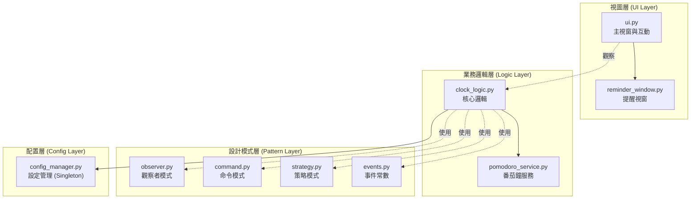
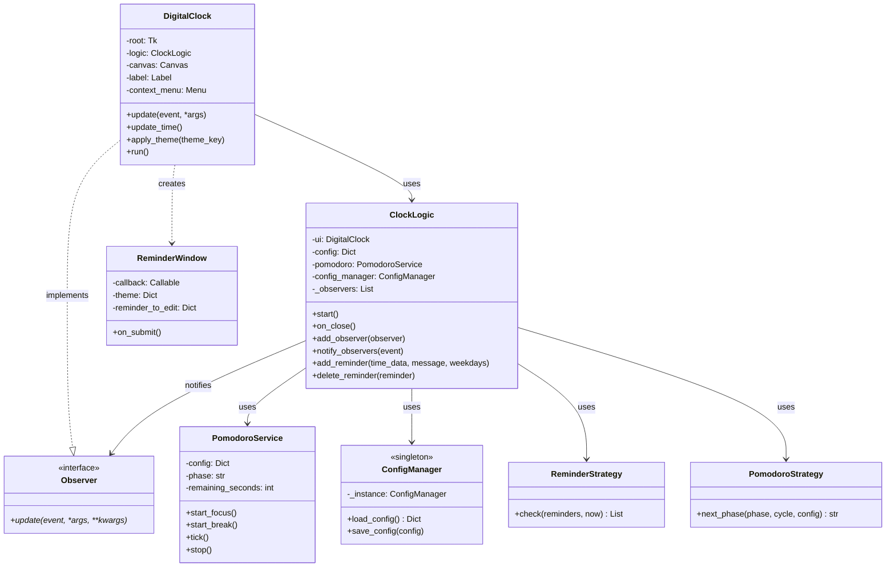
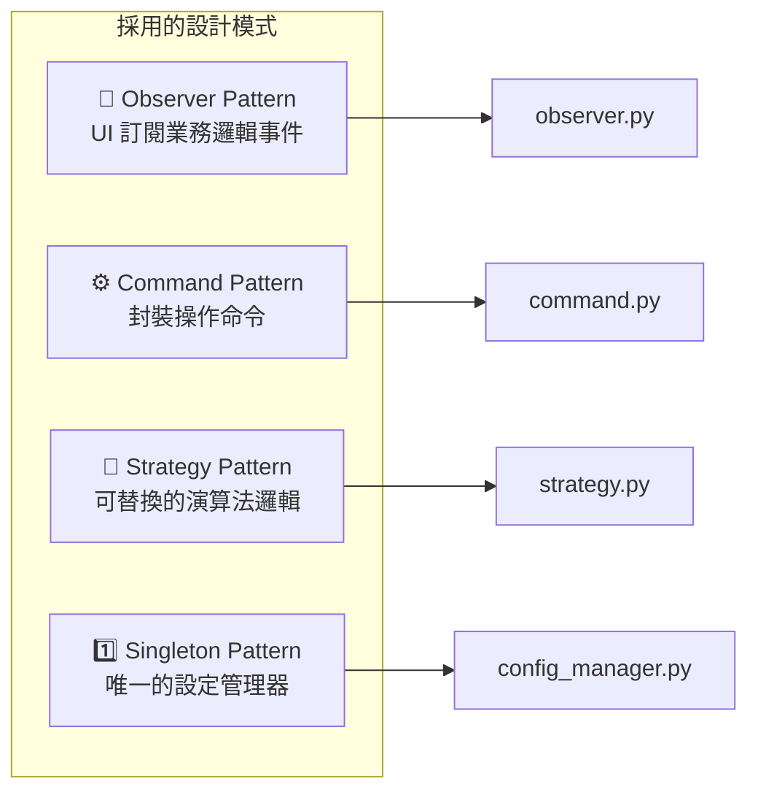

# 桌面數位時鐘 (Digital Clock) - 專案說明

## 緣起
當應用程式最大化時，自動隱藏的工具列雖然釋放了螢幕空間，卻也讓我們無法隨時看到時間。此專案旨在解決這個問題，提供一個簡潔、不干擾且永遠在最上層的桌面時鐘。

## 核心需求
- **互動性**：可自由拖曳、雙擊關閉、預設半透明，滑鼠聚焦時恢復不透明。
- **智慧隱藏**：進行螢幕截圖時，時鐘自動隱藏，不被攝入畫面。
- **背景執行**：更改副檔名為 `.pyw` 即可在 Windows 上無主控台視窗背景執行。
- **無干擾**：程式圖示不顯示在 Windows 工作列上。

---

## 架構設計（2025年重構版 v2.0）

本專案採用多種設計模式，實現了高度模組化與可維護性的架構。

### 系統架構圖



### 模組職責說明

| 模組 | 職責 |
|------|------|
| `main.py` | **程式進入點**：啟動應用程式 |
| `ui.py` | **視圖層**：管理主視窗、時間顯示、右鍵選單、拖曳、主題切換等使用者互動 |
| `reminder_window.py` | **提醒視窗**：獨立的提醒設定 UI 元件，支援單次與週期性提醒 |
| `clock_logic.py` | **核心邏輯**：業務邏輯層，負責事件通知、狀態管理、鍵盤監聽與協調各服務 |
| `pomodoro_service.py` | **番茄鐘服務**：獨立的計時引擎，管理專注/休息階段與倒數計時 |
| `config_manager.py` | **設定管理**：單例模式，集中處理 JSON 設定檔的載入與儲存 |
| `observer.py` | **觀察者基類**：定義 `Observer` 介面，供 UI 訂閱業務邏輯事件 |
| `command.py` | **命令模式**：封裝操作命令，支援提醒與番茄鐘操作的統一呼叫 |
| `strategy.py` | **策略模式**：實現提醒檢查與番茄鐘階段切換的可替換邏輯 |
| `events.py` | **事件常數**：統一管理所有事件名稱，消除 Magic String |

### 類別關係圖



---

## 核心特色

### 1. 置頂顯示與透明度
- **永遠置頂**：`self.root.attributes('-topmost', True)` 確保時鐘永遠顯示在所有視窗之上。
- **動態透明**：視窗獲得焦點時透明度設為 1.0，失去焦點時設為 0.5，實現淡入淡出效果。
- **實作位置**：`ui.py` 的 `_setup_window()` 與 `_bind_events()` 方法。

### 2. 智慧截圖躲避
- **全域鍵盤監聽**：使用 `pynput` 在背景執行緒監聽按鍵。
- **組合鍵偵測**：檢測 PrtScn 或 `Win+Shift+S` 組合鍵。
- **安全隱藏與恢復**：偵測到截圖操作時自動隱藏 2 秒，避開截圖。
- **實作位置**：`clock_logic.py` 的 `_start_keyboard_listener()`、`_on_key_press()` 方法。

### 3. 互動操作
- **拖曳移動**：`<Button-1>` 觸發 `_start_drag`，`<B1-Motion>` 觸發 `_drag`。
- **雙擊關閉**：`<Double-Button-1>` 綁定 `self.logic.on_close()`。
- **實作位置**：`ui.py` 的 `_start_drag()` 與 `_drag()` 方法。

### 4. 視覺設計
- **圓角背景**：使用 Canvas 繪製美觀的圓角矩形。
- **多款主題**：支援經典黑、護眼綠、深藍淺藍、淺色模式、琥珀色等多種配色。
- **實作位置**：`ui.py` 的 `_draw_rounded_rect()` 與 `apply_theme()` 方法。

### 5. 時間格式切換
- **12/24 小時制**：右鍵選單可切換，設定即時生效並自動儲存。
- **實作位置**：`ui.py` 的 `change_time_format()` 方法。

### 6. 提醒與週期性任務
- **單次與週期性提醒**：支援特定日期單次提醒，或每週固定時間的週期性提醒。
- **編輯與刪除**：提醒選單提供子選單，可快速編輯或刪除。
- **實作位置**：`reminder_window.py` (UI) 與 `clock_logic.py` (邏輯)。

### 7. 番茄鐘
- **專注計時**：內建番茄鐘功能，支援專注與休息階段切換。
- **狀態顯示**：番茄鐘狀態會即時顯示在時鐘旁。
- **實作位置**：`pomodoro_service.py` 與 `ui.py` 的 `update_pomodoro_display()` 方法。

### 8. 其他已實作但前文未完整提及功能
- **休假模式（Vacation Mode）**：可一鍵切換「開始休假 / 開始工作」，進入休假時會自動停止番茄鐘，並暫停一般提醒與整點網頁；結束休假後會恢復切換前的暫停狀態。
- **提醒與整點網頁可分別暫停**：兩種提醒管道可獨立「暫停 / 啟動」，並且狀態會反映在右鍵選單標籤。
- **整點網頁提醒設定視窗**：支援設定目標 URL、起訖整點時段（含邊界）、立即測試開啟網址，並保留視窗尺寸設定。
- **整點網頁觸發防重複**：同一小時只觸發一次，預設僅工作日啟用，避免重複開頁或非上班日干擾。
- **提醒視窗效率功能**：支援「上班日」快捷勾選、週期提醒時自動停用日期欄位、單次提醒預設為「目前時間 +5 分鐘」。
- **提醒彈窗不阻塞主 UI**：提醒到點時會以獨立程序顯示通知，降低主視窗卡頓風險。
- **滑鼠懸停顯示日期**：游標移到時間區域時可暫時切換顯示日期（含星期），並自動調整字級避免超出視窗。
- **字元級時間動畫**：時間切換時以字元級垂直過渡動畫呈現，並搭配快取降低重繪成本。
- **自適應刷新頻率**：動畫期高更新率、閒置期降頻更新，兼顧流暢與資源使用。
- **效能監控開關**：可在設定中啟用效能監控，定期輸出渲染與邏輯迴圈統計資訊。
- **設定檔健壯機制**：支援預設值遞迴合併、快取與檔案修改時間判定、損毀設定回退預設值。
- **啟動時自動清理過期提醒**：程式啟動時會移除已過期的單次提醒，避免歷史提醒殘留。

---

## 設計模式



| 設計模式 | 實作檔案 | 說明 |
|----------|----------|------|
| Observer | `observer.py` | `DigitalClock` 實作 `Observer` 介面，訂閱 `ClockLogic` 的事件通知 |
| Command | `command.py` | `AddReminderCommand`、`DeleteReminderCommand`、`StartPomodoroCommand` 等 |
| Strategy | `strategy.py` | `ReminderStrategy` 負責提醒檢查，`PomodoroStrategy` 負責階段切換 |
| Singleton | `config_manager.py` | `ConfigManager` 使用 `__new__` 實現單例，確保設定管理器唯一 |

---

## 程式碼品質

- ✅ **完整型別註解**：所有方法參數與回傳值均加入型別提示
- ✅ **詳細 Docstring**：每個類別與方法都有完整的說明文件
- ✅ **例外處理**：關鍵操作加入 try-except 確保程式穩定性
- ✅ **消除 Magic String**：事件名稱統一由 `Events` 類別管理
- ✅ **單一職責原則**：業務邏輯與 UI 完全分離

---

## 技術亮點

- **背景任務與主 UI 執行緒互動**：使用 `pynput` 實現全域鍵盤監聽，並透過 `tkinter.after()` 將背景執行緒事件安全傳遞給主 UI 執行緒，避免多執行緒競爭與介面凍結問題。
- **跨平台支援**：`ui.py` 的 `_setup_window()` 針對 Windows、macOS、Linux 提供不同的透明視窗實作。
- **延遲儲存機制**：`clock_logic.py` 的 `schedule_save()` 避免頻繁寫入設定檔。

---

## 檔案結構

```
digital_clock_v10/
├── main.py              # 程式進入點
├── ui.py                # 視圖層：主視窗與使用者互動
├── clock_logic.py       # 業務邏輯層：核心邏輯與事件管理
├── config_manager.py    # 配置層：設定檔載入與儲存 (Singleton)
├── pomodoro_service.py  # 服務層：番茄鐘計時引擎
├── reminder_window.py   # UI 元件：提醒設定視窗
├── observer.py          # 設計模式：觀察者基類
├── command.py           # 設計模式：命令模式
├── strategy.py          # 設計模式：策略模式
├── events.py            # 常數：事件名稱定義
└── README.md            # 專案說明文件
```

---

本專案適合需要極簡、穩定、可擴充的桌面時鐘解決方案的使用者與開發者。
